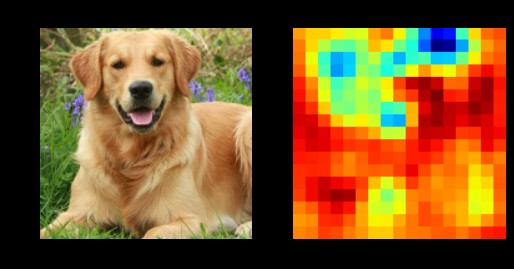

# Occlusion experiments for Image Segmentation

Follows the image occlusion pipeline presented in the paper <em>Visualising and understanding Convolutional Neural networks</em> 
by M. Zeiler et al to extract a coarse segmentation map from input image using a pre-trained CNN.

Look at the included iPython Notebook for the code. 
